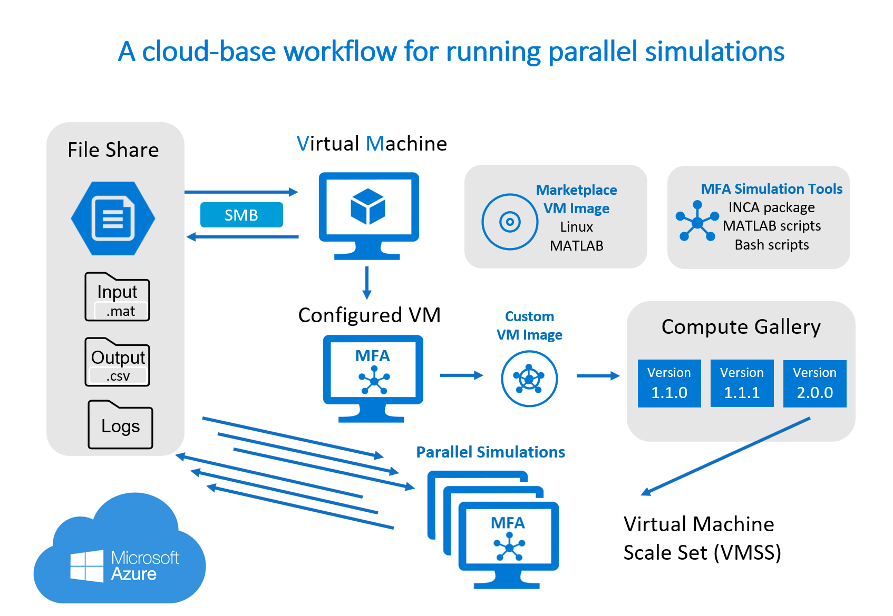
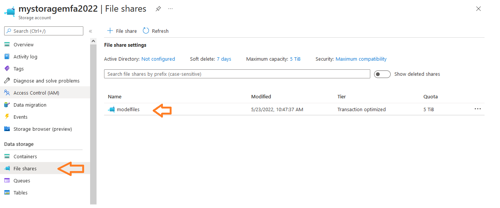
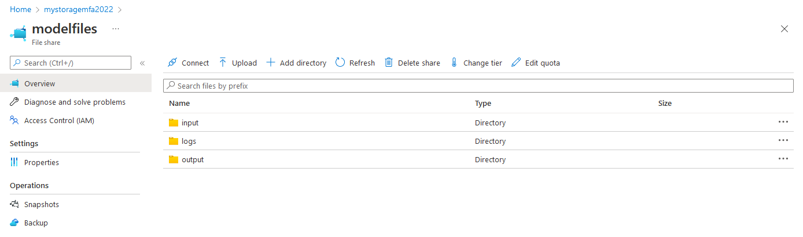
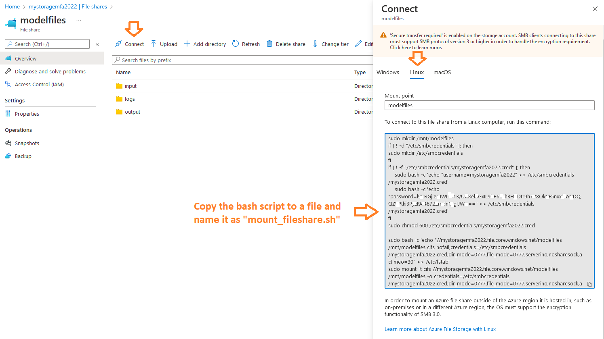
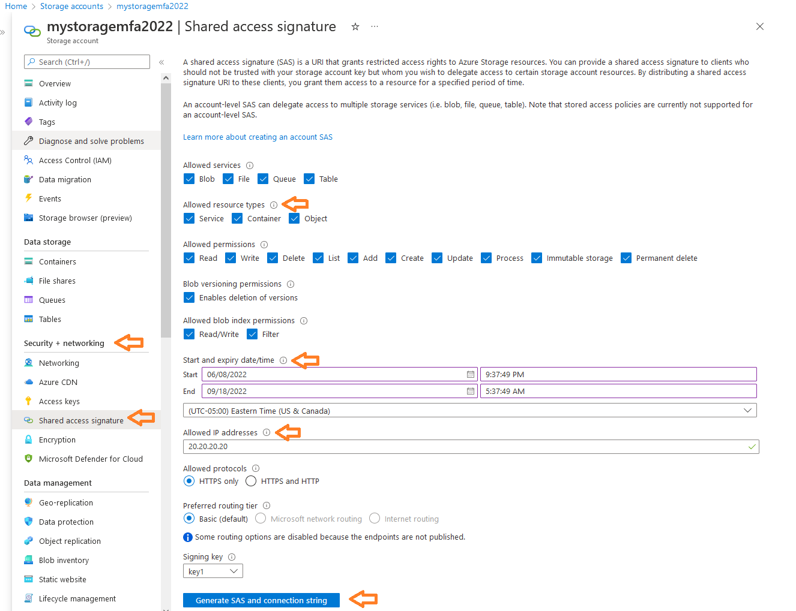
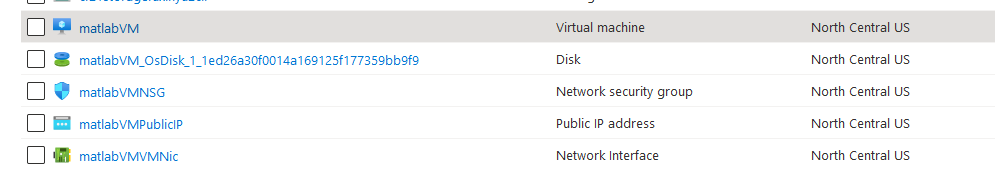
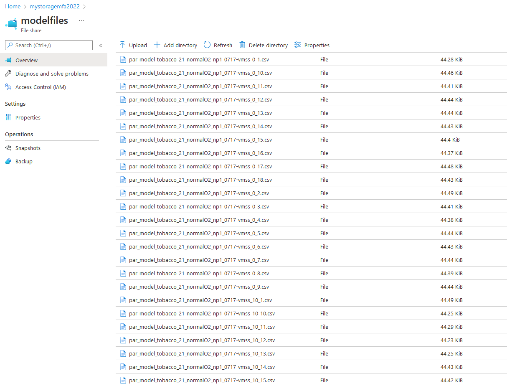
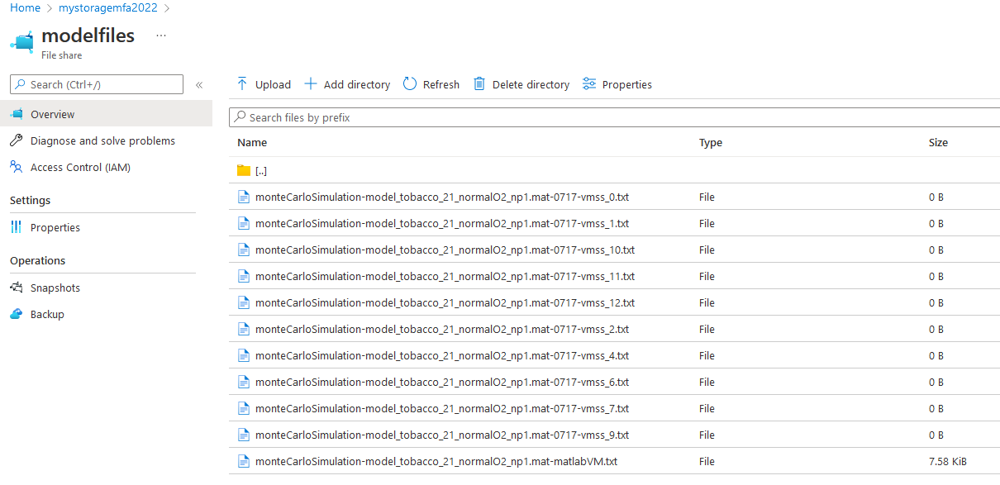

# A cloud-based workflow to run parallel simulations for metabolic flux analysis

This repository contains the documentation and scripts for using a public cloud (Microsoft Azure) to run Monte Carlo simulations for metabolic flux analysis. This work was developed during my **[MSU Cloud Fellowship 2021-2022](https://icer.msu.edu/about/announcements/introducing-2021-msu-cloud-computing-fellows)**. The workflow uses a MATLAB-based software package [INCA](https://pubmed.ncbi.nlm.nih.gov/24413674/) for demonstration and has been applied to our research work ([Fu et al. 2022, Nature Plants](https://doi.org/10.1038/s41477-022-01294-9)). 


## Introduction

Metabolic flux analysis (MFA) is a powerful approach for quantifying intracellular metabolic reaction rates in plant metabolic networks. Estimating flux parameters is solved by nonlinear fitting of a mathematical model describing the metabolic network to high-dimensional isotope labeling data, executed iteratively and computationally demanding. This analysis is typically performed using specialized MATLAB packages (e.g., INCA) available to the scientific community. One rate-limiting step of MFA is the calculation of confidence intervals for flux parameters. Analyzing the flux confidence intervals for a leaf metabolic model with about 100 reactions takes hundreds of CPU hours to complete 1000 Monte Carlo simulations. Our current workflow is enabled by submitting parallel jobs to a university-maintained High-Performance Computing (HPC) with constraints like variable queue wait times and CPU/GPU Usage Limits. This cloud-based workflow enables researchers with limited or no HPC access to run parallel simulations using multiple virtual machine (VM) instances using Microsoft Azure. In addition to the on-demand scalability provided by cloud computing, sharable access to data on the cloud allows collaborators to examine the intermediate and output data quickly and easily, accelerating scientific discovery.


## Overview of the cloud-based workflow

The Monte Carlo simulation involves inputs (model and experimental data) and outputs (thousands of simulation results in CSV format). Because the input and output datasets are small files, an **[Azure file share](https://docs.microsoft.com/en-us/azure/storage/files/storage-files-introduction)** is chosen to share datasets across multiple VMs using SMB protocol. To easily run the MATLAB-based simulation tasks, a Linux VM preinstalled MATLAB using an **[Azure Marketplace image](https://azuremarketplace.microsoft.com/en-us/marketplace/apps/mathworks-inc.matlab-byol?tab=overview)** is deployed. Then this VM is configured to be able to run the scripts for simulation and move data from and to the cloud storage (Azure file shares).

How to reuse this configured VM so that we don't need to set up the environment repeatedly? We can capture a **[VM image](https://docs.microsoft.com/en-us/azure/virtual-machines/shared-image-galleries?tabs=azure-cli)** that clones the configured VM. From this VM image, we can create many VM instances (up to 1,000) via a **[Virtual Machine Scale Sets (VMSS)](https://docs.microsoft.com/en-us/azure/virtual-machine-scale-sets/overview)**. Because the VM instances in the scale set are created using the custom VM image, they have the identical configuration for parallel simulation tasks. What if we need to change something in the VM image? It is possible to maintain multiple image versions in an **[Azure Compute Gallery](https://docs.microsoft.com/en-us/azure/virtual-machines/azure-compute-gallery)** as a repository to be used to create new VMs. Deployed VM instances can take the same new input file from the file share storage, run simulations in parallel, and write the simulation outputs back to the file share storage. The provisioning of computing infrastructures such as VM, VMSS, network, and storage are scripted using **[Azure Command-Line Interface (CLI)](https://docs.microsoft.com/en-us/cli/azure/)**, making the cloud-based workflow efficient and reproducible. 




## Step-by-step instructions

Before starting, you will need the following:

- A Microsoft Azure account (Note: there will be costs of the Azure services used when you create cloud resources using this guide)

- A license for running [MATLAB on Azure](https://www.mathworks.com/help/cloudcenter/ug/run-matlab-from-azure-marketplace.html)

- A free academic license for [INCA](https://pubmed.ncbi.nlm.nih.gov/24413674/) (Isotopomer Network Compartmental Analysis) from [http://mfa.vueinnovations.com/licensing](http://mfa.vueinnovations.com/licensing) and download the MATLAB-based software package

- Linux environment or server (can use a [virtual machine created in the Azure portal](https://docs.microsoft.com/en-us/azure/virtual-machines/linux/quick-create-portal))

  

### Getting started with Azure Command-Line Interface (CLI)

The Azure CLI is a set of commands used to create and manage Azure resources.

To install Azure CLI on Linux:
`curl -sL https://aka.ms/InstallAzureCLIDeb | sudo bash`

Refer: https://docs.microsoft.com/en-us/cli/azure/install-azure-cli-linux?pivots=apt

**To check installed version:**

`az --version`

It responds with the version number that you have installed, such as `azure-cli 2.35.0` .

**To sign into the Azure CLI:**

Run `az login` and sign in with your Azure account credentials in the browser.

Refer: https://docs.microsoft.com/en-us/cli/azure/authenticate-azure-cli

**To get a list of your subscriptions:**

`az account list --output table`

**To switch to a different subscription:**

`az account set --subscription "Cloud Fellowship"`

Supply the subscription ID or name you want to switch to (*e.g.*, Cloud Fellowship).


### Creating a Resource Group

A [**resource group**](https://docs.microsoft.com/en-us/azure/azure-resource-manager/management/manage-resource-groups-portal) is a container that holds related resources for an Azure solution.

**To create a resource group using Azure CLI:**
`az group create --name myResourceGroup --location northcentralus`

This creates a resource group named myResourceGroup in the northcentralus location.

Refer: https://docs.microsoft.com/en-us/azure/azure-resource-manager/management/manage-resource-groups-cli


> If you see an error of `AuthorizationFailed` , you probably do not have permission to create resource groups under your current subscription, so you should use the existing resource group  under your current subscription or switch to a different subscription (e.g., the free "Azure for Students" subscription).


### Creating an Azure file share

**[Azure file shares](https://docs.microsoft.com/en-us/azure/storage/files/storage-files-introduction)** can be mounted in Linux via SMB. Azure file shares are deployed into **[storage accounts](https://docs.microsoft.com/en-us/azure/storage/common/storage-account-overview)**, which are top-level objects that represent a shared pool of storage.

**To create a storage account:**

```bash
# We will store several parameters in variables. You may replace the variable contents with whatever values you wish.
resourceGroup="<resource-group-name>"
storageAccountName="<storage-account-name>"
location="northcentralus"

az storage account create \
    --resource-group $resourceGroup \
    --name $storageAccountName \
    --location $location \
    --kind StorageV2 \
    --sku Standard_LRS 
```

Note: 

- Storage account name must be globally unique and between 3 and 24 characters in length and use numbers and lower-case letters only.

- The `--kind StorageV2` parameter specifies the General purpose version 2 (GPv2) storage accounts, which allows you to deploy Azure file shares on standard/hard disk-based (HDD-based) hardware.

- The `--sku` parameter relates to the type of redundancy desired, `Standard_LRS` is Locally redundant storage, resilient to two data copy failures.


Now that you've created a storage account, you can create your Azure file share named `modelfiles`.

**To create a new Azure file share under the specified storage account:**

```bash
# Store parameters in variables
resourceGroup="<resource-group-name>"
storageAccountName="<storage-account-name>"
shareName="modelfiles"

az storage share-rm create \
    --resource-group $resourceGroup \
    --storage-account $storageAccountName \
    --name $shareName
```

If you open the storage account from the Azure portal and navigate to `Data Storage`->`File shares`, the file share we created will be listed:



**To create new directories in the file share:**

```bash
#  For organizing purposes, let's create three directories named input,output, and logs at the root of the Azure file share created earlier:
az storage directory create \
   --account-name $storageAccountName \
   --account-key $storageAccountKey \
   --share-name $shareName \
   --name "input"

az storage directory create \
   --account-name $storageAccountName \
   --account-key $storageAccountKey \
   --share-name $shareName \
   --name "output"

az storage directory create \
   --account-name $storageAccountName \
   --account-key $storageAccountKey \
   --share-name $shareName \
   --name "logs"
```

Navigate to the file share in the Azure portal, you will see the three directories created:



**To get the bash script for connecting to the file share from a local Linux computer:**

Navigate to the file share in the Azure portal, click `Connect` and select `Linux`, you can copy the bash script for connecting to the file share and save it in a new file named `mount_fileshare.sh`. This script contains sensitive password information, keep it somewhere safe in you local computer.



Refer: https://docs.microsoft.com/en-us/azure/storage/files/storage-how-to-use-files-portal?tabs=azure-cli


###  Uploading data to Azure file share using AzCopy

**[AzCopy](https://docs.microsoft.com/en-us/azure/storage/common/storage-ref-azcopy)** is a command-line utility that you can use to copy files to or from a storage account. As of now, you can only authorize AzCopy to access your file share using a Shared Access Signature (SAS) token. A SAS is a URI that grants restricted access rights to Azure Storage resources.

**To install AzCopy on your Linux machine:**

```bash
#Download AzCopy
wget https://aka.ms/downloadazcopy-v10-linux
 
#Expand Archive
tar -xvf downloadazcopy-v10-linux
 
#(Optional) Remove existing AzCopy version
sudo rm /usr/bin/azcopy
 
#Move AzCopy to the destination you want to store it
sudo cp ./azcopy_linux_amd64_*/azcopy /usr/bin/

sudo chmod +x /usr/bin/azcopy

#Check version if succesfully installed
azcopy --version
```

The above script puts the AzCopy executable into the /usr/bin folder so that you can run it from anywhere.

**To get the access to your Azure file share:**

You need to obtain the Shared Access Signature (SAS) token for the storage account containing the file share.  Open the storage account from the Azure portal and navigate to the `Security+Networking` section, then select `Shared access signature`. Specify `Allowed resource types`（check all options),  `Start and expiry date/time`,  `Allowed IP addresses`, then click `Generate SAS and connection string`.



Copy the File service SAS URL from the portal. It should be similar to this:

```
https://mystoragemfa2022.file.core.windows.net/?sv=2021-06-08&ss=bfqt&srt=sco&sp=rwdlacupitfx&se=2022-06-18T03:56:34Z&st=2022-07-17T19:56:34Z&sip=20.20.20.20&spr=https&sig=somerandomlettersdigits%
```

**To upload a file from your local linux into the file share:**

```bash
azcopy copy './model_tobacco_21_normalO2_np1.mat' 'https://mystoragemfa2022.file.core.windows.net/modelfiles/input?sv=2022-06-18&ss=bfqt&srt=sco&sp=rwdlacupitfx&se=2022-09-18T03:56:34Z&st=2022-07-17T19:56:34Z&sip=20.20.20.20&spr=https&sig=somerandomlettersdigits%'
```

- This example shows how you to upload an input file `model_tobacco_21_normalO2_np1.mat` into the `input` directory of the file share `modelfiles`. Note that you can specify your file destination in the url `https://mystoragemfa2022.file.core.windows.net/modelfiles/input` . The rest of the url contains the SAS token copied from the last step.
- You can also upload the contents of a directory without copying the containing directory itself by using the wildcard symbol (*).

Refer: https://docs.microsoft.com/en-us/azure/storage/common/storage-use-azcopy-v10 and https://docs.microsoft.com/en-us/azure/storage/common/storage-use-azcopy-files


### Getting an Azure Marketplace image with Linux and MATLAB

In Azure Marketplace, there are several images with Ubuntu VM and MATLAB offered by Mathworks. 
Refer: https://github.com/mathworks-ref-arch/matlab-on-azure#architecture-and-resources

**To find Azure Marketplace images with Linux and MATLAB installed:**

`az vm image list --offer matlab --all --output table`

A list of images will be shown in the terminal.

**A Marketplace image in Azure has the following attributes:**

- Publisher: The organization that created the image, e.g., `mathworks-inc`
- Offer: The name of a group of related images created by a publisher, e.g., `matlab-ref-arch-18a-v1-linux-disk`
- SKU: An instance of an offer, such as a major release of a distribution, e.g., `matlab-ref-arch-20a-vm-linux-sku`
- Version: The version number of an image SKU, e.g., `1.0.2`
- URN: `Publisher:Offer:Sku:Version` a combination of the values separated by the colon (:), e.g., `mathworks-inc:matlab-ref-arch-18a-v1-linux-disk:matlab-ref-arch-20a-vm-linux-sku:1.0.2`

>  You can replace the version number in the URN with latest to use the latest version of the image. 

Refer: https://docs.microsoft.com/en-us/azure/virtual-machines/linux/cli-ps-findimage

***For this guide, we will use the image with Ubuntu 18.04 and MATLAB R2020a.***

**To check the purchase plan information the Marketplace image:**

`az vm image show --urn mathworks-inc:matlab-ref-arch-18a-v1-linux-disk:matlab-ref-arch-20a-vm-linux-sku:1.0.2`

Copy the purchase plan information from the response for later use:

```
"plan": {
    "name": "matlab-ref-arch-20a-vm-linux-sku",
    "product": "matlab-ref-arch-18a-v1-linux-disk",
    "publisher": "mathworks-inc"
  },
```

To deploy this image, you must provide the purchase plan parameters when you deploy a VM using that image.


### Creating a virtual machine (VM) using the Marketplace image

**To create a VM using the Marketplace image with preinstalled Linux and MATLAB:** 

```bash
# Store parameters in variables
resourceGroup="<resource-group-name>"
username="matlabuser"
password="<strong-p@ssword>"
vmName="matlabVM"
vmSize="Standard_B1ms"

az vm create \
    --resource-group $resourceGroup \
    --admin-username $username \
    --admin-password $password \
    --name $vmName \
    --size $vmSize \
    --storage-sku Standard_LRS \
    --image mathworks-inc:matlab-ref-arch-18a-v1-linux-disk:matlab-ref-arch-20a-vm-linux-sku:latest \
    --plan-name matlab-ref-arch-20a-vm-linux-sku \
    --plan-product matlab-ref-arch-18a-v1-linux-disk \
    --plan-publisher mathworks-inc
```

- This creates a VM named matlabVM and adds a user account named `matlabuser` and your desired password. 
- For an image with purchase plan parameters, you pass the URN for `--image` and also **must provide the purchase plan parameters** `--plan-name`, `--plan-product`, and `--plan-publisher`. 

- If you want create a Linux VM that uses secure shell (SSH) keys for authentication, you can add the  `--generate-ssh-keys` parameter to automatically generate an SSH key, and put it in the default key location (~/.ssh). 
- Once VM is deployed, your terminal will show information of the VM. You will also see the VM and related resouces in your recource group via the Azure portal:



**To grab the name of your VM:**

`az vm list --query [].name` `-o tsv`

**To get the public IP of your VM:**

`az vm show -d -g $resourceGroup -n $vmName --query publicIps -o tsv`

Copy the IP address to be used in the next step.


### Configuring the VM to run INCA

**To connect to the VM via ssh:**  
`ssh matlabuser@[IP-Address]`

**To start MATLAB and enter your login credentials:**

```bash
matlabuser@matlabVM:~$ matlab
MATLAB is selecting SOFTWARE OPENGL rendering.
Please enter your MathWorks Account username and press Enter:
Please enter your MathWorks Account password and press Enter:
```

**Preparing files to be uploaded to the VM**

The following files or directories are needed:

- `mount_fileshare.sh` (the file created earlier for connecting to the file share from a Linux computer)

- `INCAv1.8` (the [INCA](http://mfa.vueinnovations.com/licensing) package you downloaded for the MFA analysis, you may use a newer version of INCA)

- `monteCarloSimulation.m` (a MATLAB script provided in this repository for running the Monte Carlo simulations using INCA)
- `bashMonteCarloSimulation.sh` (a bash script provided in this repository to run the prior MATLAB script with desired parameters)

After compressing all files/directories needed into `inca_azure.zip` locally, you can transfer it the remote VM by running  the`scp` command in your local Linux machine:

`scp inca_azure.zip matlabuser@[IP-Address]:/home/matlabuser`

**To test the uploaded scripts in the VM:**

```bash
# unzip the file in a directory named inca_azure
unzip inca_azure.zip -d inca_azure

# navigate to mount_fileshare.sh and run it
cd /home/matlabuser/inca_azure/
chmod +x mount_fileshare.sh
./mount_fileshare.sh

# check if the file share is mounted
df -h
```

If the file share is mounted successfully, you will see something like: 

Filesystem  `//mystoragemfa2022.file.core.windows.net/modelfiles`

Mounted on `/mnt/modelfiles`

We can then test the Monte Carlo simulation script using the uploaded model in the mounted file share `/mnt/modelfiles` as follows:

```bash
chmod +x bashMonteCarloSimulation.sh
./bashMonteCarloSimulation.sh model_tobacco_21_normalO2_np1.mat 3
```

- For`bashMonteCarloSimulation.sh`, model name (`model_tobacco_21_normalO2_np1.mat`) is the first command-line argument and the number of iterations to perform (`3`) is the second command-line argument. 
- You need change the path names in the bash script if you name your file share differently or use a different version of INCA.
- Make sure the Monte Carlo simulation script is correctly run before moving on to the next step.


### Creating a custom image from the configured VM for MFA
We will create a custom images that copies the full VM we just configured for MFA. This custom image can  be used over and over again to create new VMs and be stored in a repository called **[Azure Compute Gallery](https://docs.microsoft.com/en-us/azure/virtual-machines/azure-compute-gallery)** that you can control who has access to.  We will also need to create **[image definitions](https://docs.microsoft.com/en-us/azure/virtual-machines/shared-image-galleries?tabs=azure-cli)**, which is a logical grouping for images and are used to manage information about the **[image versions](https://docs.microsoft.com/en-us/azure/virtual-machines/shared-image-galleries?tabs=azure-cli)** that are created within them.

**To create an Azure Compute Gallery for managing and sharing images:**

`az sig create --resource-group $resourceGroup --gallery-name myGallery`

**To create an image definition:**

```bash
# Store parameters in variables
resourceGroup="<resource-group-name>"
galleryName="<gallery-name>" 
imageDefinition="<image-definition-name>" 

# Create an image definition
az sig image-definition create \
    --resource-group $resourceGroup \
    --gallery-name $galleryName \
    --gallery-image-definition $imageDefinition \
    --publisher myPublisher \
    --offer myOffer \
    --sku mySku \
    --os-type linux \
    --os-state specialized \
    --plan-name matlab-ref-arch-20a-vm-linux-sku \
    --plan-product matlab-ref-arch-18a-v1-linux-disk \
    --plan-publisher mathworks-inc
```

Because we want to use the VM without removing existing user accounts, we create a [specialized image](https://docs.microsoft.com/en-us/azure/virtual-machines/shared-image-galleries#image-definitions) definition using `--os-state specialized`.

**To create the image version:**

```bash
# Store parameters in variables
resourceGroup="<resource-group-name>"
galleryName="<gallery-name>" 
imageDefinition="<image-definition-name>"
location="northcentralus"
imageVersion="1.0.1"
# Get the resource ID of the matlab VM
imageID=$(az vm show -g $resourceGroup -n $vmName --query "id" -o tsv)

az sig image-version create \
   --resource-group $resourceGroup \
   --gallery-name $galleryName \
   --gallery-image-definition $imageDefinition \
   --gallery-image-version $imageVersion \
   --target-regions $location \
   --managed-image $imageID
```

**To list the image versions in a gallery:**

```bash
az sig image-version list --resource-group $resourceGroup --gallery-name $galleryName --gallery-image-definition $imageDefinition
```

The ID of your image version is shown in the output of the command, like

```
/subscriptions/<subscriptionid>/resourceGroups/myresourcegroup/providers/Microsoft.Compute/galleries/myGallery/images/mfaImageDefinition/versions/1.0.1
```

Copy this ID to be used in the variable `imageVersion` below.

Refer: https://docs.microsoft.com/en-us/azure/virtual-machines/linux/tutorial-custom-images


### Creating a VM scale set from the custom image

The following script creates a VM scale set (10 instances) with the image version we created earlier. 

```bash
# Store parameters in variables
resourceGroup="<resource-group-name>"
vmssName="<vmss-name>"
imageVersion="<image-version-id>"
planName="matlab-ref-arch-20a-vm-linux-sku" 
planProduct="matlab-ref-arch-18a-v1-linux-disk" 
planPublisher="mathworks-inc"
instanceCount="10"
vmSize="Standard_B1ms"
vnetName="$vmssName-vnet"
subnetName="$vnetName-subnet"
lbName="$vmssName-lb"
lbRule="$lbName-network-rule"
nsgName="$vmssName-nsg"
upgradePolicyMode="automatic"
adminName="matlabuser"
adminPassword="<strong-p@ssword>"

# Create Network Security Group
echo "Creating network security group $nsgName"

az network nsg create \
--resource-group $resourceGroup \
--name $nsgName

echo "Network security group created: $nsgName"

# Create VM Scale Set
echo "Creating VM scale set $vmssName"

az vmss create \
  --resource-group $resourceGroup \
  --name $vmssName \
  --image $imageVersion \
  --plan-name $planName \
  --plan-product $planProduct \
  --plan-publisher $planPublisher \
  --instance-count $instanceCount \
  --vm-sku $vmSize \
  --nsg $nsgName \
  --subnet $subnetName \
  --vnet-name $vnetName \
  --load-balancer $lbName \
  --upgrade-policy-mode $upgradePolicyMode \
  --admin-username $adminName \
  --admin-password $adminPassword \
  --storage-sku Standard_LRS \
  --specialized \
  --verbose  

echo "VM scale set created: $vmssName"

# Associate NSG with VMSS subnet
echo "Associating NSG: $nsgName with subnet: $subnetName"

az network vnet subnet update \
--resource-group $resourceGroup \
--name $subnetName \
--vnet-name $vnetName \
--network-security-group $nsgName \
--verbose

echo "NSG: $nsgName associated with subnet: $subnetName"

# Add port 22 to inbound rule NSG
echo "Adding port 22 to NSG $nsgName"

az network nsg rule create \
--resource-group $resourceGroup \
--nsg-name $nsgName \
--name Port_22 \
--destination-port-ranges 22 \
--direction Inbound \
--priority 110 \
--verbose

echo "Port 22 added to NSG: $nsgName"
echo "VMSS setup is completed!"
```

- We need to add port 22 to inbound rule of Network Security Group to enable SSH connection.
- Purchase plan information is also needed here.
- If you don't specify `-storage-sku Standard_LRS` to the `vmss create` command, the OS disk may use `Premium SSD LRS`, which is more expensive.

Refer: https://docs.microsoft.com/en-us/cli/azure/vmss?view=azure-cli-latest

https://docs.microsoft.com/en-us/azure/virtual-machine-scale-sets/tutorial-use-custom-image-cli


### Using the VM scale set

For this workflow, the deployed VM instances can take the same new input file from the mounted Azure file share, run the simulation script in parallel, and write the simulation outputs and logs back to the file share. 

**To view information about a scale set:**

```bash
az vmss show --resource-group $resourceGroup --name $vmssName
```

**To view VM instances in a scale set:**

```bash
az vmss list-instances \
--resource-group $resourceGroup \
--name $vmssName \
--output table
```

**To list connection information (public ips) for VMs in a scale set:**

```bash
# Find the port for connecting via SSH 
az vmss list-instance-connection-info \
   --resource-group $resourceGroup \
   --name $vmssName
```

You can also use `--output table` parameter to Get public ips of vmss instances as table.

**To SSH connect to a VM using the public ip with a port number:**

`ssh matlabuser@[public-ip] -p [port-number]`

**To run the simulation script in a VM:**

```bash
# To start a screen session
screen -S vm

# To attach the Azure file share
cd /home/matlabuser/inca_azure/
chmod +x mount_fileshare.sh bashMonteCarloSimulation.sh
./mount_fileshare.sh

# To run Monte Carlo simulations with desinated model input
# 1st arg is file name, 2nd arg is number of iterations for this script
./bashMonteCarloSimulation.sh model_tobacco_21_normalO2_np1.mat 50

# To detach from the session and return to main terminal, press Ctrl + A and D. The simulation script will run in the background. 

# To reattach the session, type screen -r
```

- Because the simulation task take a long time to complete, we cannot close the SSH connection to the remote VMs. A solution is to use the Screen command to separate processes running in different sessions. Even if we are offline, the remote server can still run the simulation task in the background. Refer: https://medium.com/geekculture/run-background-program-with-screen-a7eb301a9284
- The `bashMonteCarloSimulation.sh` calls the **[Azure Instance Metadata Service (IMDS)](https://docs.microsoft.com/en-us/azure/virtual-machines/linux/instance-metadata-service?tabs=linux)** API. Each running VM Instance can get its unique VM Instance ID and supply this ID information to the simulation outputs. In this way, failed VM can be spotted in time so that we can take corrective actions.

Once the Monte Carlo simulation script is running, you will see new files being generated in the `output` and `logs` in Azure portal.

- Output files in the file share
  

- Log files in the file share
  


###  Downloading data from Azure file share using AzCopy
**To download the entire file share directory `modelfiles` to the local Linux machine:**

```bash
mkdir modelfiles
azcopy copy 'https://mystoragemfa2022.file.core.windows.net/modelfiles?sv=2022-06-08&ss=bfqt&srt=sco&sp=rwdlacupitfx&se=2022-09-18T03:56:34Z&st=2022-07-17T19:56:34Z&sip=20.20.20.20&spr=https&sig=somerandomlettersdigits%' './modelfiles' --recursive
```

- Note that you can specify the target directory in the url `https://mystoragemfa2022.file.core.windows.net/modelfiles` . The rest of the url contains the SAS token copied from the Azure portal earlier.

- Append the `--recursive` flag to download files in all sub-directories.

**To analyze the summary statistics of the output files:**

- A python script `summarizeMonteCarloSimulations.py` is provided in this repository to summarize the output files and compute statistics. 
- Place the python script inside the folder with simulation results of a model. Run it in the terminal and the summary statistics will be written to a new csv file in the same folder.  


### Cleaning up resources

To delete the resource group and all its resources:

```bash
az group delete --name $resourceGroup --no-wait --yes
```

Alternatively, you can delete the resources in the Azure portal to avoid unnecessary costs.


## Comparing VM types and sizes

There are many VM types and sizes to choose. A simple INCA simulation script was run on a few different VMs to compare the simulation time and cost.

| **VM Size** | **vCPUs** | **RAM** | **Max IOPS** | **Time (normalized to<br />the least time needed)** | **Monthly <br />Cost** |
| ----------- | --------- | ------- | ------------ | ---------------------------------------------------- | ---------------------- |
| B1ms        | 1         | 2       | 640          | 1.1 X                                                | $15                    |
| B2s         | 2         | 4       | 1280         | 1 X                                                  | $30                    |
| B4ms        | 4         | 16      | 2880         | 1.1 X                                                | $121                   |
| A1_v2       | 1         | 2       | 2x500        | 2.9 X                                                | $31                    |
| DS1_v2      | 1         | 3.5     | 3200         | 1.2 X                                                | $47                    |

Among the model B series, B2s took the least time (1 X). Increasing CPUs and RAMs doesn’t speed up the program. B1ms is only 10% slower than B2s but half the price, so ***B1ms is the most cost-effective for this workflow***. Model A and D series with 1 CPU (A1_v2 and DS1_v2) are slower but more expensive for this specific script.


## Challenges and future work

There are some challenges associated with the Azure Marketplace image with the preinstalled MATLAB. It requires you to enter the license information to launch MATLAB, but the licensing credential usually expires after two days. To avoid entering the license information to every VM in the scale set, you can update the VM image version with the active licensing credential. It is important to supply the purchase plan information as parameters when using a custom image based on a third-party marketplace image to create VM or VMSS. Without the purchase plan information, you will encounter failed deployments due to "missing plan information." 

A more efficient way to run scripts across multiple VMs is to use the **[Azure Custom Script Extension](https://docs.microsoft.com/en-us/azure/virtual-machines/extensions/custom-script-linux)**. However, when MATLAB scripts are executed using the Custom Script Extension, the terminal shows `Warning: Cannot locate Java Runtime Environment (JRE) ...  Error: 88: No JRE version parsed from /usr/local/matlab/sys/java/jre/glnxa64/jre/release`. Future work is needed to resolve this issue so we can run MATLAB scripts across VMs without logging into those VMs.


## Acknowledgements

This work was supported in part through Michigan State University’s Institute for Cyber-Enabled Research Cloud Computing Fellowship, with computational resources and services provided by Information Technology Services and the Office of Research and Innovation at Michigan State University. Special thanks to the guidance and support from the Cloud Computing Fellowship instructors: Patrick Bills (Data Science Technical Lead, MSU IT Services) and Dr. Mahmoud Parvizi (Research Consultant, MSU ICER).